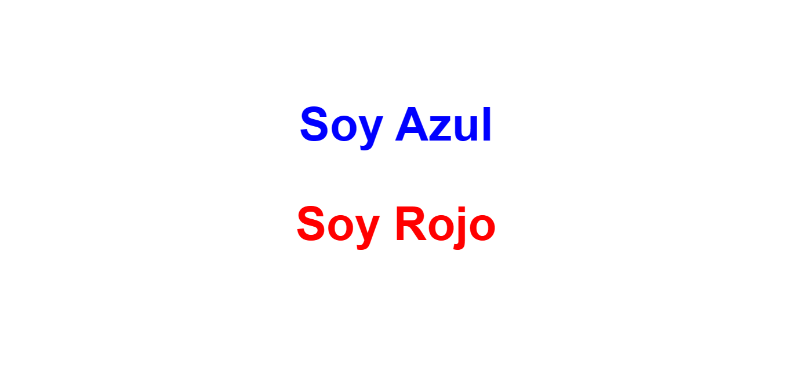

<h1>Taller 9 Karen Johanna González</h1>

<h2> Información</h2>

Curso: full Stack Basico - Grupo 1

Profesor: Cristian Patiño

<h2> Punto 1: Link figma</h2>

<a href="https://www.figma.com/file/GZZgAap9nAPJzI971L6yQN/Karen-Gonz%C3%A1lez-Proyecto-Figma?type=design&node-id=5%3A745&mode=design&t=jV0PJyj2SP6tQfeD-1 " target="_blank">Link de Figma</a>

<h2>punto 2 HTML</h2>

<h2>punto 3 css</h2>

<h2>punto 4</h2>

<h2>punto 5</h2>

<h2>punto 6</h2>

<h2>punto 7</h2>

<h2>punto 9</h2>

<h2>punto 10</h2>

<h2>punto 11</h2>

<h2>punto 12</h2>
